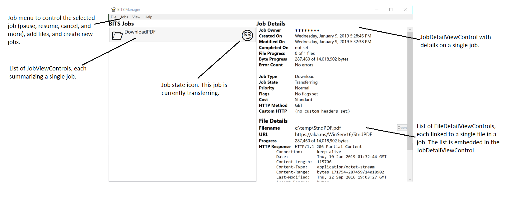

# Contributing

This project welcomes contributions and suggestions.  Most contributions require you to agree to a
Contributor License Agreement (CLA) declaring that you have the right to, and actually do, grant us
the rights to use your contribution. For details, visit https://cla.microsoft.com.

When you submit a pull request, a CLA-bot will automatically determine whether you need to provide
a CLA and decorate the PR appropriately (e.g., label, comment). Simply follow the instructions
provided by the bot. You will only need to do this once across all repos using our CLA.

This project has adopted the [Microsoft Open Source Code of Conduct](https://opensource.microsoft.com/codeofconduct/).
For more information see the [Code of Conduct FAQ](https://opensource.microsoft.com/codeofconduct/faq/) or
contact [opencode@microsoft.com](mailto:opencode@microsoft.com) with any additional questions or comments.

# What is BITS Manager
BITS Manager is a sample GUI tool for examining and creating BITS (Background Intelligent Transfer Service) uploads and downloads. It uses information from the [Calling into BITS from .NET and C# using Reference DLLs](https://docs.microsoft.com/en-us/windows/desktop/Bits/bits-dot-net) documentation to create a program that can

* list all jobs and all files in each job
* create new jobs and add file to jobs
* examine job and file settings

# The different states

Each job is marked with an icon that represents its state. See the [Life Cycle of a BITS Job](https://docs.microsoft.com/en-us/windows/desktop/Bits/life-cycle-of-a-bits-job) for details on the different BITS jobs states that are possible and how they transition from one to the other.

|BITS State Icons| |
|-----------------|--|
|**Starting States**| |
|Suspended|😴|
|**Action States**|
|Queued |🙂|
|Connecting |😵|
|Transferring |😏|
|Transient Error |😬|
|**Transferred States**|
|Error |😡|
|Transferred |😁|
|**Final States**|
|Acknowledged |😎|
|Cancelled |😧|

Once a job is in a final state, it will no longer be enumerated. Jobs that had been enumerated but which no longer show up in an enumeration will be marked with a ⧆ character.

# Building BITS Manager

To build your own verison of BITS Manager

* download all of the source code including the solution (.SLN) files
* open the solution file in Visual Studio. The solution has been tested on version 15.8.9. Visual Studio must include the .NET desktop development option.
* from the menu, select Build➔Solution to build the project

# A quick tour of the BITS Manager code

The list of jobs is set up in MainWindow.xaml.cs in the RefreshJobsList function. This function calls EnumJobs on the main BITS IBackgroundCopyManager object. The RefreshJobList makes a series of JobViewControl XAML User Controls, one control for each BITS job.

The **JobViewControl** control displays a single job's name and description and sets the state image based on the state. When, in the MainWindow's list of JobViewControls, a single JobViewControl is selected, the JobDetailViewControl is updated with that job

The **JobDetailViewControl** control, when given a BITS job to display, performs three tasks. 
* The **SetJob** method updates the display with details about the job (for example, the owner, the current status, job flags). 
* The **ListBITSJobFiles** method updates the list of files associated with the job. It does this by creating new FileDetailViewControl objects, one per file.
* The **EnableActionButton** method picks which buttons (Cancel, Complete, Pause, Resume) are enabled based on the current job state

The **FileDetailViewControl** class contructor, when given a BITS job and file, will update the control with details about the job.

The **MainWindow** class also contains 
* the Timer and corresponding **Timer_Tick** function that updates the job list and keeps it fresh
* the UI code to handle ^K^V and menu requests
* complete code to handle quick file downloads
